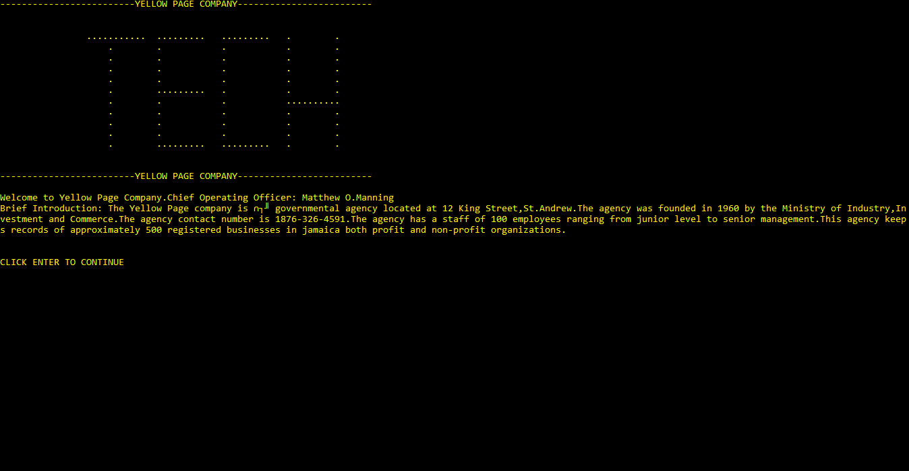
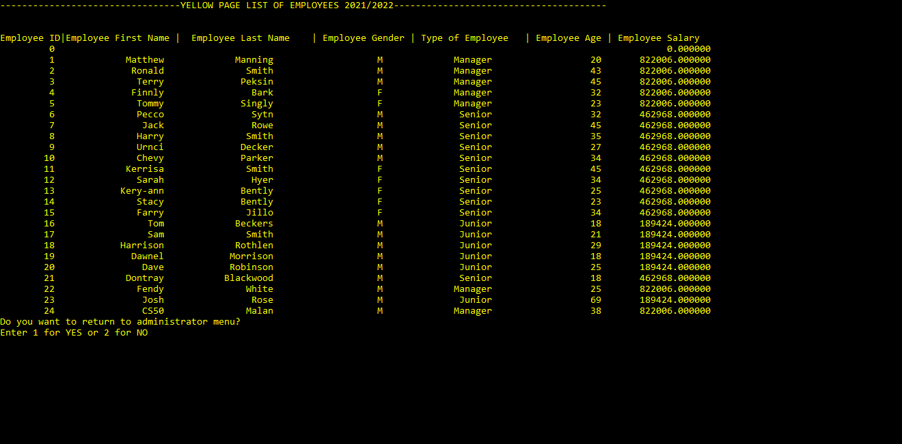

#  Yellow Page Company
#### Video Demo:  <URL HERE>
#### Description:

 #                                       Introduction

The Yellow Page Company is a governmental agency which realized their current manual system is not effective. The company developed a project to attain a more effective system. In this project, the programmer has divided the
project in different sections to show the different ways a program can be represented. This includes a Narrative,and C programming Section. The programming section includes the full C code of the program. The project also includes screenshots of how the program will run.Entering the profile, they are three main options: Employee Login, Admin Login and Exit the program. To gain access to each of two login options, the user will need a username and password. The preset credentials for the Employee
Login are:
Username: employee@ Password: PAsword@1
When logged in the Employee Menu, the employee will have the options of viewing all registered companies reports, adding a company, searching for a company and returning to the general menu options.
The preset credentials for the Admin Login are:
Username: admin1 Password: passkey1
When logged in the Admin Menu, the administrator will have the option of viewing all employed workers at the Yellow Page company information, adding an employee, searching for an employee and returning to the general menu.

#                                   Assumptions

It was assumed that for the “employee” and “Admin” profiles specific usernames and passwords need to be entered before they can be used. The username and password was assumed
to be “employee@” and “PAsword@1” respectively for the “Employee” profile and “admin1” and “passkey1” respectively for the “Admin” profile. It was assumed that all company names are unique. It was also assumed
that all employee ids are unique

  #                                          Problem Definition

The Yellow Page Company is à governmental agency located at 12 King Street, St. Andrew. The agency was founded in 1960 by the Ministry of Industry, Investment and Commerce. The agency contact number is 1876-326-
4591.The agency has a staff of 25 employees ranging from junior level to senior management. This agency keeps records of approximately 50 registered businesses in Jamaica both profit and non-profit organizations. The company
currently utilizes a manual system to keep track of each of the businesses information. In this system, the employees utilize à pen, ruler, calculator and several large inventory books to keep updated records of each of the businesses
the information.
Employees find the current system exhausting and time consuming because they have to manually enter/update each company records by hand. Employees have to keep track of each of the company&#39;s revenue with the help of à
calculator. The staff is currently pressured because they have to handle many organization details simultaneously. Consequently this may result in incorrect calculation of each company annual income which would lead to inaccurate tax
returns. This results in organizations paying more or less tax. These hand-written records are not ideal and are hard to decipher. Every year the staff members are shifted meaning that each year different staff members handle a different set
of company records. Due to hand-written records, the staff members sometimes misinterpret the information that was previously recorded. The Yellow Page agency is aware that some companies are trying to gain access to their records to
change their tax returns, as a result the agency wants a system that is secure so that only authorized persons can gain access.
À C program will be developed which stores the names of the employees, the names of the companies each employee is assigned and the employee password. The employee password should be set in advance. When à employee
enters their name and correct password, they will be able to gain access to the different companies they were assigned. The authorized employee will then be able to add à company by entering the company name, address, number of
employees, type of organization(profit or non-profit),the company founding year, the amount of years registered , the company income and expenses monthly. The authorized employee should be able to input each of the company
information. This information will be stored in à file.
 The C program should then be able to output a general report for each company which includes the name of the company, the amount of years it has been registered, the year it was founded, the number of employees in the
company, type of company, the revenue and expenses, tax  annually. The program should also output the company with the highest income, the lowest income, the highest tax and the lowest tax. The program should also generate employee
reports from the Yellow Page Company, each showing the employees name, type (junior or senior or manager), sex (male and female), age and salary per year.

 #                                           Narrative

Throughout the program the background color displayed is black while the text color is yellow. The program will begin with a welcome screen showing a TECH graphic and a brief introduction of the yellow page company. The
screen will be cleared before switching to the General Menu Options. In the general menu options, three options are displayed: 1. Employee Login, 2.Admin Login and 3. Exit Program. The user is prompted to choose a number
corresponding to their option. If the user hasn’t entered a valid input, a message is displayed telling the user to enter 1, 2 or 3 and they have limited chances to do so. The program halts execution for five seconds then the user is given three
chances to enter a correct number. On the third chance and the user hasn’t entered a valid input, a message is displayed telling the user they have exceeded their chances. The screen changes to red and the program ends within 10 seconds.
Upon selecting ‘1’, which is the Employee Login, the screen will be cleared and the user will be prompted to enter the username which is ‘employee@’ and password which is ‘PAsword@1’. If the user hasn’t entered the correct username
and/ password. A message will be displayed telling the user what exactly they entered incorrectly. The user will then be given three chances to enter a valid input/s. Upon the third chance and the user hasn’t entered a valid input/s, the
program displays a message that the user has no more attempts and the program ends immediately. Once the correct username and password is entered, a success message will be displayed , the program will then halt for five seconds , the
screen will be cleared and the employee will be taken directly to the Employee Menu Options. Through the Employee Menu, the user is given four options: 1.View Company’s General Report, 2. Add a company, 3. Search for a company,
4.Return to General Main Menu.
The user is prompted to choose a number corresponding to their option. If the user hasn’t entered a valid input, a message is displayed telling the user to enter 1, 2, 3 or 4 and they have limited chances to do so. The program halts
execution for five seconds then the user is given three chances to enter a correct number. On the third chance and the user hasn’t entered a valid input, a message is displayed telling the user they have exceeded their chances. The screen
changes to red and the program ends within 10 seconds. Upon selecting option ‘1’, this is View Company’s general report, the screen is cleared and the employee will now see all of the registered companies information such as the
company name, year founded, years registered, number of employees, type of company, company address, yearly revenue, expenses and tax which was stored in a file called company50.txt and an analysis of all revenues and taxes. Under
the analysis, the employee will see the current company with the maximum revenue, government tax and the minimum revenue, government tax. . The employee will then be asked if they would like to return to the employee menu. Based
upon their selection, the screen will change to blue and the employee will be prompted back to the employee menu or the screen will change to red and the program will end. In the event, the file cannot be found an error message is
displayed “Error: File doesn&#39;t exist” and the employee is returned to the employee menu. If the employee selected ‘2’, this is to add a company, the screen is cleared and the employee will be asked to enter the full name of the company, the
year the company was founded, years registered, number of employees, type of company, company address, monthly revenue, expenses and tax. The company50.txt file will be then updated and the company will now be added to the file.
A receipt will then be shown, confirming that the company is uploaded to the system at the specific date and time along with all the company information which was uploaded. At the end of the receipt, the total cost for registering the
company is displayed. This cost was calculated by the amount of employees in this particular company. The employee will then be asked if they would like to return to the employee menu. Based upon their selection, they will be prompted
back to the employee menu or exit the program. In the event, there is no file, an error message will be displayed that says “Error: File doesn&#39;t exist” and the program will return to the employee menu. If the employee selected ‘3’, this is to
search for a company the screen will then be cleared. The employee is prompted for the name of the company whose information they would like to be found. The text file company50.txt will then open for reading and if the company name

Page 8 of 202
the employee entered matches with any company name in the file, the program will print out that specific company information. In the event there is no text file, an error message will be displayed stating “Error: File doesn&#39;t exist” and the
program will return to the employee menu. If the employee selected ‘4’, this is to return general menu options. The screen is cleared and the program returns to the general menu options immediately.
Upon selecting ‘2’, which is the Admin Login, the user will be prompted to enter the username which is ‘admin1’ and password which is ‘passkey1’. If the user hasn’t entered the correct username and/ password. A message will be
displayed telling the user what exactly they entered incorrectly. The user will then be given three chances to enter a valid input/s. Upon the third chance and the user hasn’t entered a valid input/s, the program displays a message that the user
has no more attempts and the program ends immediately. Once the correct username and password is entered, a success message will be displayed, the program will halt for five seconds, the screen will be cleared and the admin will be
directly taken to the Administrative Menu Options. Through the Administrative Menu Options, the user is given four options: 1.View Employees General Report, 2. Add an employee, 3. Search for an employee, 4.Return to General Main
Menu.
The user is prompted to choose a number corresponding to their option. If the user hasn’t entered a valid input, a message is displayed telling the user to enter 1, 2, 3 or 4 and they have limited chances to do so. The program halts
execution for five seconds then the user is given three chances to enter a correct number. On the third chance and the user hasn’t entered a valid input, a message is displayed telling the user they have exceeded their chances. The screen
changes to red and the program ends within 10 seconds. Upon selecting option ‘1’, this is View Employees general report, the screen is cleared and the admin will now see all of the registered employees information at the Yellow Page
Company such as the employees full name, type (junior or senior or manager),sex (male and female),age and salary per year which was stored in a file called employees22.txt. The administrator will then be asked if they would like to return
to the administrative menu. Based upon their selection, they will be prompted back to the administrative menu or exit the program. In the event, the file cannot be found an error message is displayed “Error: File doesn&#39;t exist” and the
administrator is returned to the administrative menu options. If the administrator selected ‘2’, this is to add an employee, the screen is cleared and the administrator will be asked to the employees full name, type (junior or senior or
manager),sex (male and female),age. The employees22.txt file will be then updated and the employee will now be added to the file. The administrator will then be asked if they would like to return to administrative menu options. Based
upon their selection, they will be prompted back to the administrative menu or exit the program. In the event, there is no file, an error message will be displayed that says “Error: File doesn&#39;t exist” and the program will return to the
administrative menu. If the administrator selected ‘3’, which is to search for an employee, the screen will then be cleared. The administrator is prompted for the name of the employee whose information they would like to be found. The text
file employees22.txt will then open for reading and if the employee name entered matches with any employee name in the file, the program will print out that specific employee information. In the event there is no text file, an error message
will be displayed stating “Error: File doesn&#39;t exist” and the program will return to the administrative menu. If the employee selected ‘4’, this is to return general menu options. The screen is cleared and the program returns to the general
menu options immediately.

Upon selecting ‘3’ under the general main menu which is to exit the program, the screen is cleared and the user will be prompted, “Are you sure you want to exit the program? Enter 1 for YES and 2 for NO?” If a user enters a
invalid input, the user is asked for a valid input three times before the program ends. If the user selects 1, the program screen changes to blue and a message is displayed, “Goodbye. Have a great day”. If the user selects 2, the program
displays a message “Returning to general menu option, please wait…” the program halts execution for 10 seconds, the screen clears and the program returns to the general menu options.

By: Matthew Manning
Data Structures used: Linked List , Hash Table
Sorting Algorithms: Bubble Sort, Selection Sort
Search : Linear Search

# OPTION 1 EMPLOYEE LOGIN

# OPTION 2 ADD A COMPANY

# OPTION 3 SEARCH FOR AN COMPANY

# ADMIN LOGIN

# OPTION 1 SHOW ALL EMPLOYEES

# OPTION 2 ADD AN EMPLOYEE

# OTPION 3 SEARCH FOR AN EMPLOYEE

# SEARCH FOR AN EMPLOYEE BY POSTION
